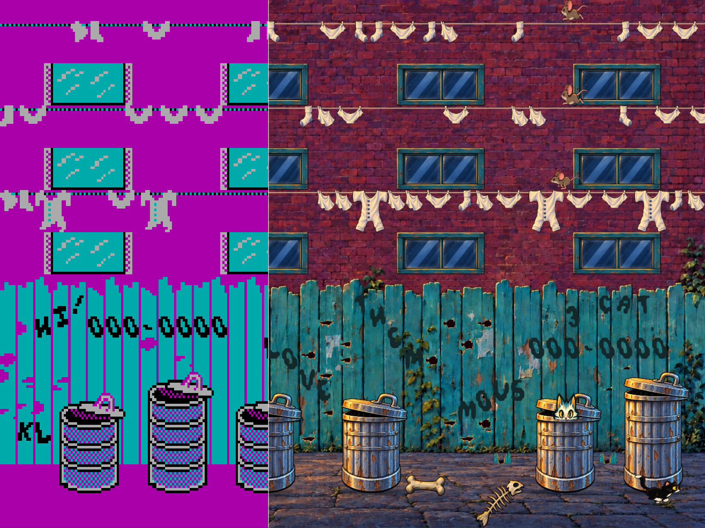
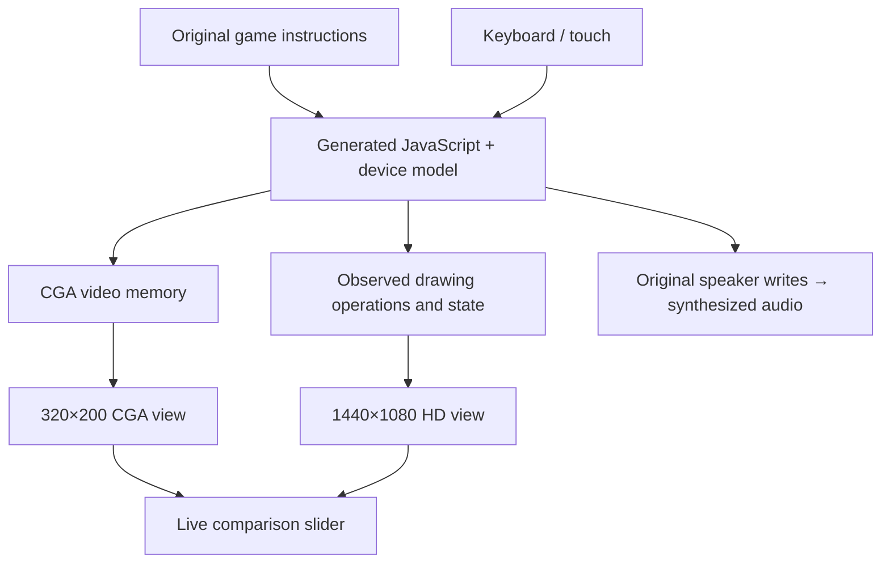
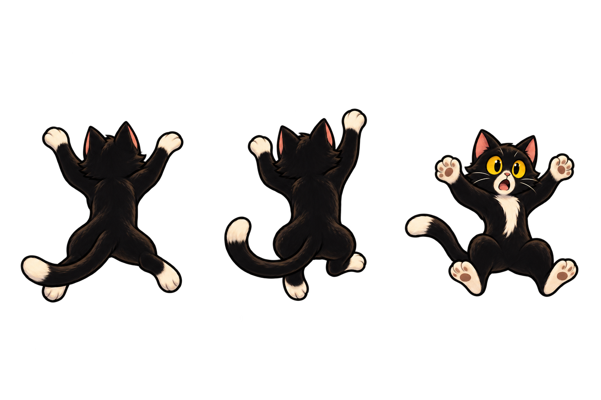
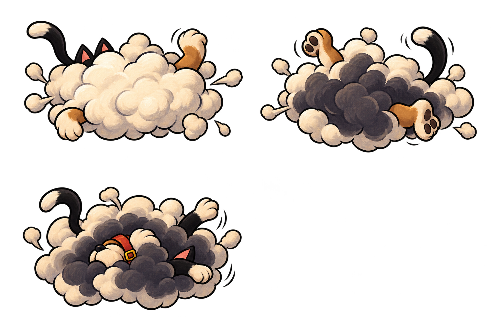
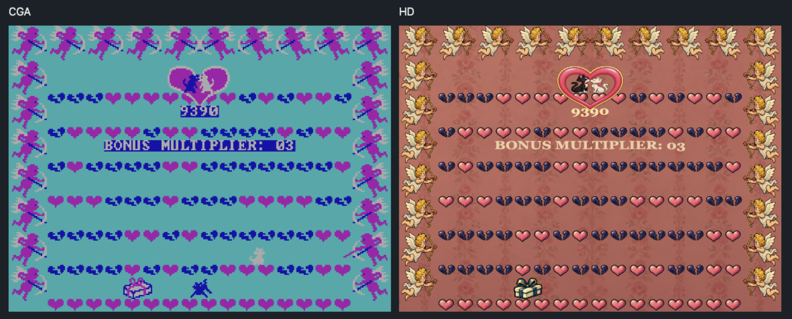
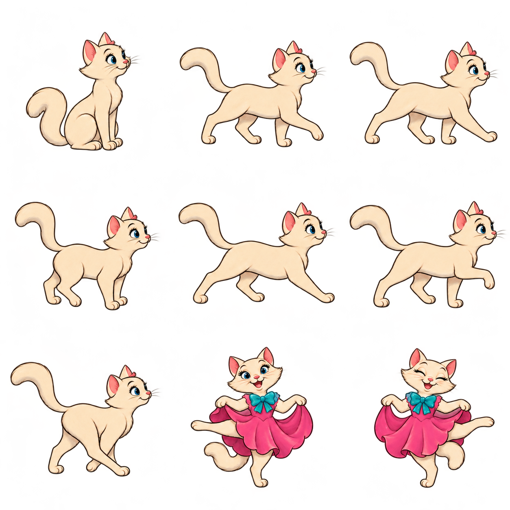
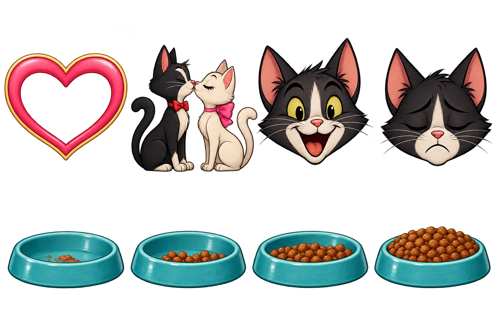
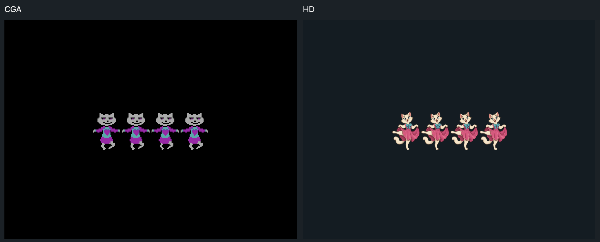

# Alley Cat Remastered

**From a 1984 DOS executable to a playable HD remaster.**

This project began by reverse-engineering Alley Cat into assembly that rebuilds the original DOS executable **byte for byte**. We then statically translated its instructions into JavaScript and built an independent HD renderer around the running game, with AI-generated artwork.

The original instructions still drive movement, collisions, enemies, scoring, and progression. The **live CGA/HD slider** reveals two views of the same execution.

[**Play in your browser →**](https://dk8827.github.io/alleycat-remastered/)

[How it works](#one-game-two-views) · [Artwork](#artwork) · [Verification](#4-compare-execution-then-test-the-presentation) · [Run locally](#run-locally) · [Source guide](docs/architecture.md)



**55,067 bytes matched · 8,546 instructions translated · One game, two renderers**

## One game, two views

The game still draws its original CGA graphics into video memory. Those bytes produce the 320×200 view. Alongside it, an observer captures drawing operations and game state for a separate 1440×1080 HD renderer.



The slider reveals two presentations of **one execution**. There is one cat position, one set of enemies, one collision system, and one score. Dragging the divider does not restart the game or change its rules.

For example, the original instructions decide when a window opens, how far it has opened, and whether the cat can enter. The HD renderer uses that state to draw the painted window. The same separation applies to the bins, clotheslines, room hazards, fight animations, and courtship sequences.

## How it was built

### 1. Recover a byte-exact disassembly

The first stage was a matching disassembly: recovering the executable’s assembly instructions and initialized data into buildable source. NASM reproduces the entire file, including instructions, graphics, sound tables, the executable header, relocations, and padding.

Every build checks the result against the original SHA-256 before translation. A changed byte fails the build. The [assembly](game/asm/alleycat.asm) and [build tools](tools/build.py) are included in this repository.

### 2. Translate the instructions ahead of time

The [translator](tools/translate.py) emits JavaScript for each instruction, grouped into 99 code pages. The execution layer preserves the 16-bit registers, flags, segmented memory, stack, and control flow. Instruction addresses remain available for observing the game and debugging it.

The browser executes this generated code directly. A device model provides the BIOS services, keyboard state, clock, CGA behavior, and programmable timer the game expects. Speaker timer and gate writes drive audio synthesis, preserving the game's own melodies and effect sequences.

All of this runs in the browser. The local Node process only serves static files.

<details>
<summary>See an actual 8086 instruction become JavaScript</summary>

At `CS:002F`, the game prepares the BIOS video-mode request:

```asm
mov ax, 4
```

The generated JavaScript for that instruction, formatted for readability:

```js
case 47:                 // CS:002F
  c.ip = 50;             // Address of the next instruction
  c.r[0] = 4 & 65535;     // AX, kept within 16 bits
  return;
```

Other instructions use the same register and memory model, with helpers for arithmetic flags, interrupts, and device I/O. The instruction addresses connect the assembly, generated code, and presentation hooks.

</details>

### 3. Fit the artwork to the game

The HD layer observes the game's drawing operations and uses their positions, selected sprite frames, clipping, and drawing order. Gameplay continues to own collision and animation state.

Making that convincing required more than replacing sprites. Painted bin rims must meet the original landing surface. Clothes need the original count and dimensions. Windows need every opening phase. A cat hanging from a line needs the correct back-facing pose. Erased sprites, fight clouds, score lettering, and transitions must appear and disappear with their CGA counterparts.

The renderer maps scenery landmarks with patches and triangles, and registers characters against their original visible bounds. CGA pixels also have a display aspect to account for: both views are shown at 4:3, so a game coordinate maps to HD with **X × 4.5 and Y × 5.4**.

### 4. Compare execution, then test the presentation

We checked the translated program against original-code execution, then added regressions for gameplay, sound, and the HD view. The repository includes the recorded baseline fixtures and tests that replay them: [execution checkpoints](tests/core.test.mjs), [behavioral contracts](tests/contracts.test.mjs), and [renderer checks](tests/renderer.test.mjs).

| Check                 | Coverage                                                                                                                       |
| --------------------- | ------------------------------------------------------------------------------------------------------------------------------ |
| Exact game build      | All **55,067 bytes**, enforced by SHA-256                                                                                      |
| Execution checkpoints | **165** startup/gameplay checkpoints and **640** room checkpoints: registers, game data, and CGA memory                        |
| Behavioral contracts  | **3,314** recorded executions covering objectives, collisions, progression, restart, and more; device events replayed in order |
| Live sessions         | **8 scenes × 4 difficulties × 2 timing profiles**                                                                              |
| Save / restore        | Deterministic subsequent game state, presentation, and audio                                                                   |
| Presentation          | Sprite bounds, contact points, clipping, drawing order, room transitions, and cinematics                                       |

Run `npm test` to execute the **82-test suite**. CI builds and tests the project from a fresh checkout.

**What “original” means here:** the rebuilt DOS program is byte-identical, and the translated execution matches the recorded states in the covered tests. Browser device timing is modeled. We do not claim cycle-exact physical-PC behavior, identical audio waveforms, or proof of every possible playthrough.

## Artwork

**All new HD artwork were created with ChatGPT Images 2.5.** Characters, scenery, props, and effects were generated in a consistent classic cartoon style, then prepared as sprite sheets and registered to the original game's coordinates and animation states.

These are source sheets used by the renderer. The jumping and hanging poses face away from the camera, just as they do in CGA; the fight clouds replace the original cat-and-dog scuffle frames.

| Jumping, hanging, and falling                                                                                      | Cat-and-dog fight                                              |
| ------------------------------------------------------------------------------------------------------------------ | -------------------------------------------------------------- |
|  |  |

The same approach extends to the game's courtship and bonus sequences. Below, the original CGA view is on the left and the HD presentation is on the right.



<details>
<summary>More artwork: courtship animation, results, and food bowls</summary>

| Courtship animation sheet                                             | Result screens and food bowls                                                                       |
| --------------------------------------------------------------------- | --------------------------------------------------------------------------------------------------- |
|  |  |



</details>

The image-generation credit covers the new HD artwork. Original CGA graphics, game data, music, and sound effects come from Alley Cat; sprite registration, clipping, and procedural drawing are handled by the renderer.

## Play

[**Play Alley Cat Remastered**](https://dk8827.github.io/alleycat-remastered/) — no installation required. Start the game, then drag the CGA/HD divider while you play.

- Eight scenes, room challenges, courtship, and four difficulty settings.
- A live CGA/HD slider that also works through transitions and result screens.
- PC speaker music and effects, keyboard and touch controls.
- Pause, full screen, and a browser-local save slot.
- Static hosting, with no application backend or DOSBox runtime required.

## Run locally

Install **Node.js 22 or later**, **Python 3.10 or later**, and **NASM**. On macOS, NASM is available through `brew install nasm`; on Debian/Ubuntu, use `sudo apt-get install nasm`. Ensure `node`, `python3`, and `nasm` are on your PATH.

```sh
git clone https://github.com/dk8827/alleycat-remastered.git
cd alleycat-remastered
npm ci
npm run setup
npm run dev
```

Open **http://127.0.0.1:8770/** and choose **Play Alley Cat**. The setup command installs Python build dependencies into this project's `.venv`. It does not install Python packages globally. Set `PYTHON` when running setup to select a different Python executable.

Sound starts after you press Play. You can listen to the title music or choose **Enter the alley** to start immediately.

## Controls

| Control           | Action                                            |
| ----------------- | ------------------------------------------------- |
| Arrow keys / WASD | Move and jump                                     |
| Space / Alt       | Room-specific action                              |
| Home / Page Up    | Jump left / right                                 |
| Numeric keypad    | Directional movement                              |
| Escape            | Pause / resume; exit full screen                  |
| Ctrl+R            | Restart                                           |
| Ctrl+S            | Toggle sound                                      |
| HD ↔ CGA slider  | Reveal either presentation of the same game state |

Drag the large slider or the divider directly over the game to compare graphics, even before pressing Play. Touch controls appear on touch devices. Open **Options** for difficulty, practice rooms, and Save / Restore. Opening Options pauses gameplay; closing it resumes a game that was running. Saves use one browser-local slot. Saves are not synchronized across devices and may be unavailable in private browsing. Switching tabs pauses gameplay.

## Development

```sh
npm test              # Build the engine and run regression tests
npm run build         # Package the static player into dist/
npm start             # Serve the existing dist/ build
npm run check         # Tests plus the complete static build
npm run format:check  # Check JavaScript and JSON formatting
```

The development server serves the packaged files. Rebuild after editing source; it does not provide hot reload. To check deployment under a repository subdirectory:

```sh
BASE_PATH=/alleycat-remastered PORT=8771 npm start
```

Open `http://127.0.0.1:8771/alleycat-remastered/`. Any static host can serve `dist/`; no Python service, DOSBox download, or application backend is needed at runtime. HTTPS or localhost is required for browser cryptography and reliable audio startup.

The hosted demo uses GitHub Pages. Pushes to `main` deploy the static player only after the workflow's tests and build succeed; pull requests run checks without publishing.

| Directory   | Purpose                                                         |
| ----------- | --------------------------------------------------------------- |
| `game/asm/` | Game program and data used by the build                         |
| `engine/`   | Translated execution support, devices, sound, and game sessions |
| `renderer/` | CGA decoding and HD drawing                                     |
| `web/`      | Player interface, controls, storage, and audio playback         |
| `assets/`   | Source artwork and sprite crop definitions                      |
| `tools/`    | Build, translation, and local static server                     |
| `tests/`    | Engine, gameplay, audio, and presentation regression tests      |

Read [architecture](docs/architecture.md) for the data flow and [contributing](CONTRIBUTING.md) before changing gameplay or artwork.

## Compatibility and limitations

The player has been checked in desktop Chromium and Firefox, and mobile WebKit. Browser audio starts after a user gesture, and switching tabs pauses the game. See [testing](docs/testing.md) for coverage, browser checks, and how to report a problem.

## Credits and notices

Alley Cat was created by Bill Williams. This is an unofficial fan project. All new HD artwork were created with **ChatGPT Images 2.5** and registered to the game's drawing coordinates.

See [notices](NOTICE.md) and [component licensing](LICENSES.md) for original game material and third-party components.
