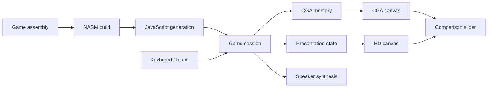

# Architecture

The browser runs JavaScript generated from the game program. A small execution layer preserves its registers, memory, flags, control flow, keyboard state, timers, and speaker writes. It supplies the device behavior the game expects; there is no DOSBox runtime in the player.

## Game sessions

`engine/portable-session.js` owns the execution model and produces a frame plus audio samples. The game program determines movement, collisions, objectives, score, lives, and transitions. The presentation layer observes drawing operations and frame boundaries; it does not decide game outcomes.

The build verifies the game image checksum before translating it. Memory addresses and drawing hooks depend on this layout. Changes to the game program require deliberate updates to the translator and observers; changing instruction offsets alone will break those contracts.

Generated JavaScript lives in `build/generated/`. Edit `tools/translate.py` or the source modules, not generated output.

## Presentation

`renderer/renderer.js` decodes CGA memory into a 320×200 canvas and draws the HD view into a 1440×1080 canvas. Both are displayed at 4:3. A CGA coordinate maps to HD using X × 4.5 and Y × 5.4, preserving the original display aspect.

The comparison slider changes how much of the CGA canvas is visible. It never switches game engines or runs a second game session.

`assets/atlas.json` defines sprite crops. `renderer/registration.js` maps scenery landmarks to game coordinates. Some images need multiple patches or triangles so that painted perspective agrees with the game's platform and collision geometry. Keep opaque pixels, transparent margins, clipping, and contact points in mind when replacing art.

The build converts the selected PNGs to WebP delivery files. It verifies image dimensions and exact alpha values; RGB compression is lossy. Hashed asset names and a generated manifest connect the player to those files.

## Audio and scheduling

`engine/speaker.js` synthesizes the speaker stream from timer and gate writes. `web/platform.js` queues the PCM in Web Audio. The live loop advances the session to keep a short audio queue filled, even while muted. Pause, focus loss, and restore clear queued samples to avoid stale sound.

## Saves

A save includes machine memory, registers, timing state, audio synthesis state, presentation state, and cinematic progress. IndexedDB stores typed arrays directly. A version and game checksum guard the persistent slot. Restoring a save replaces the complete session state rather than reconstructing it from a score or room number.

## Static packaging

`npm run build` creates a self-contained `dist/`. Imports and asset URLs resolve relative to their modules, so the same package can be hosted at `/` or a subdirectory. The local Node server serves only this directory. Nothing from the source tree needs to be exposed by a production host.

## First load and comparison

`web/boot.js` loads the comparison controls and two small preview captures before loading the engine. Both captures show the same frame from the original game running through `PortableSession`. They are presentation previews, not a running game. The CGA capture is intentionally displayed at 4:3 to account for its original pixel aspect ratio.

Pressing Play dynamically imports `web/app.js` and loads the full artwork. The previews are then replaced with live canvases, preserving the chosen divider position. `web/viewer.js` keeps the two canvases and preview images aligned; `web/comparison.js` synchronizes the native range control, pointer dragging, and keyboard access. Options uses a modal dialog and pauses an active game while it is open.
